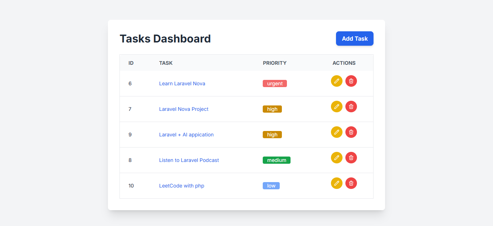
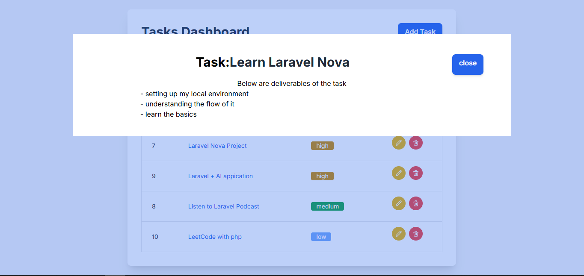
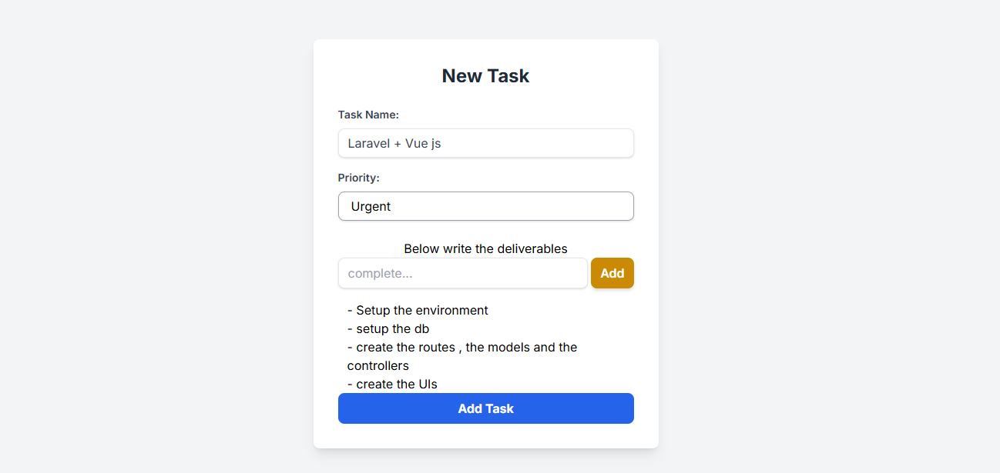
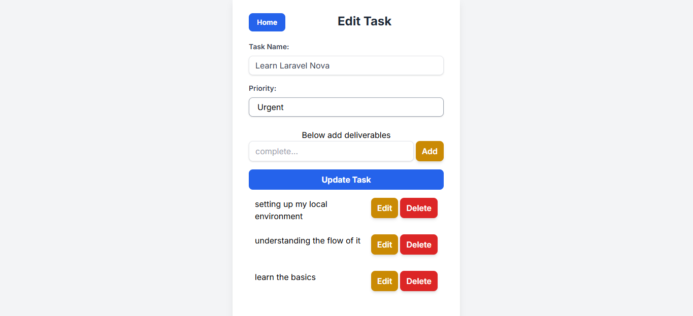

# Task Management Application

This is a simple  task management application built with Laravel, allowing users to efficiently create, manage, and track their tasks.

---

## Table of Contents

- [Features](#features)
- [Installation](#installation)
- [Screenshots](#screenshots)
---

## Features

- **Task Creation**: Easily add new tasks with a title and priority.
- **Task Listing**: View all your tasks in a clean and organized list.
- **Task Editing**: Update task details as needed.
- **Task Deletion**: Remove completed or unwanted tasks.
- **Task Viewing**: By clicing on the task name you can see the deliverables expected.

---

## Installation

Follow these steps to get the application up and running on your local machine.

### Prerequisites

- PHP >= 8.0
- Composer
- Node.js & npm (for frontend assets)
- MySQL or PostgreSQL database

### Steps
**Clone the repository**
```sh
git clone https://github.com/Denis-Wanjohi/task_management.git

cd task_management
```
**Install Composer Dependencies**
```sh
composer install
```
**Copy the Environment File**
```sh
cp .env.example .env
```
**Generate the Application Key**
```sh
php artisan key:generate
```
**Configure the Database**
```sh
DB_CONNECTION=mysql      
DB_HOST=127.0.0.1 
DB_PORT=3306      DB_DATABASE=your_database_name
DB_USERNAME=your_database_username
DB_PASSWORD=your_database_password
```
**Run the migrations**
```sh
php artisan migrate
```
**Serve the project**
```sh
php artisan serve
```

Go to your browser and access the project through port 8000(http://127.0.0.1:8000)


---

## Screenshots
**Dashboard**


**View Task**


**Create Task**


**Edit Task**


